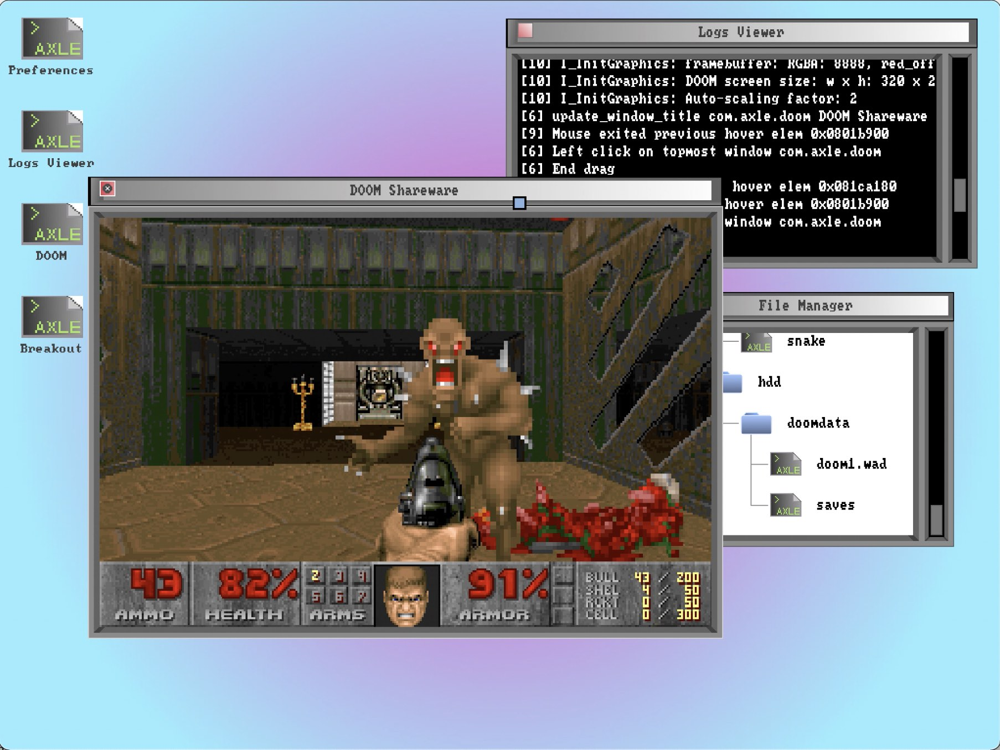
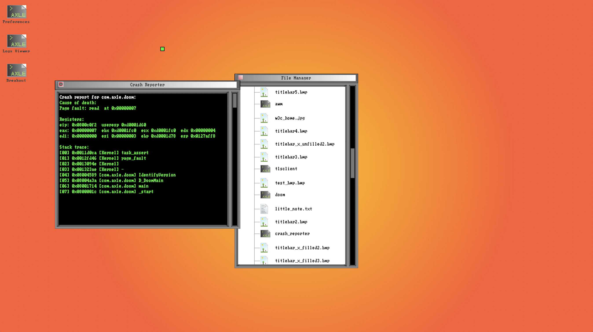
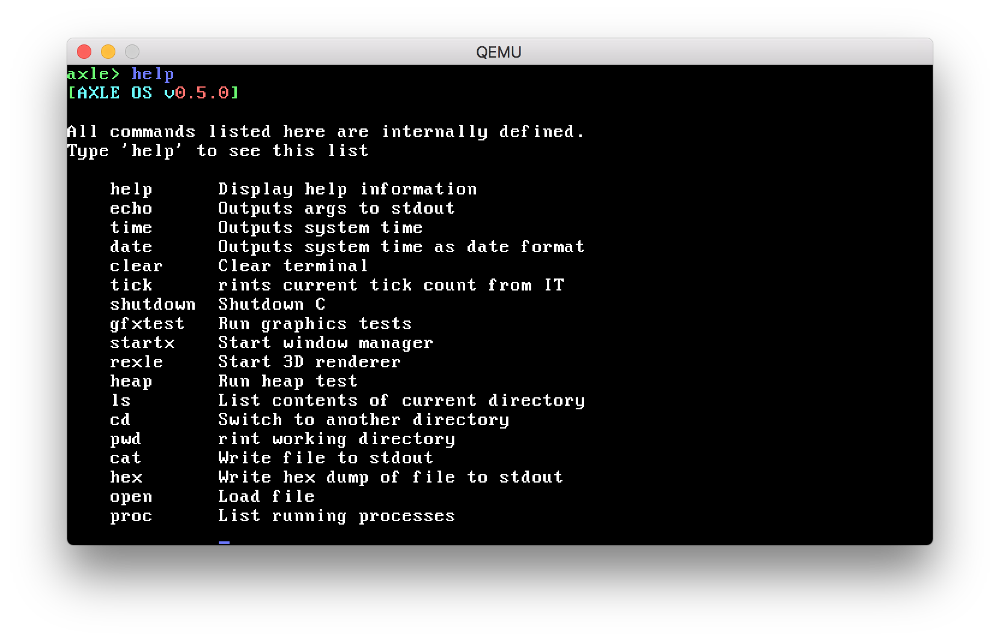
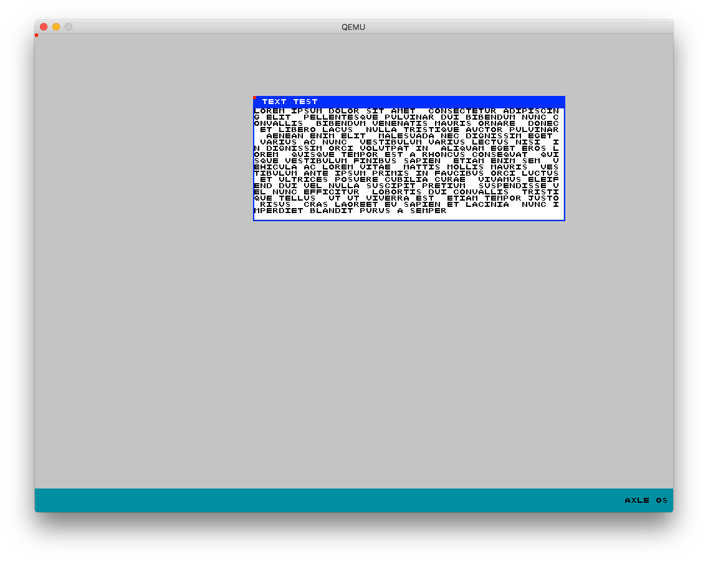

axle is a **UNIX-like** hobby operating system. Everything used within axle is **implemented from the ground up**, aside from the bootloader, for which we use GRUB. axle is a **multiboot compliant** kernel. axle runs C on 'bare metal' in freestanding mode, meaning even the C standard library is not included. A subset of the C standard library is implemented within axle's kernel, and a userspace is provided through a **Newlib port**. axle provides a **desktop environment** via an efficient compositor and a homegrown GUI toolkit library.

The initial entry point must be done in ASM, as we have to do some special tasks such as setting up the GRUB header, pushing our stack, and calling our C entry point. This means that the first code run is in `boot.s`, but the 'real' entry point is in `kernel.c`.

Features (2021)
------------

* Compositing window manager with animations, alpha blending, and window clipping
* TCP/IP stack
* HTML/CSS rendering engine
* Userspace games like Snake, Breakout, DOOM (ported), and 2048
* Userspace applications like a web browser supporting HTTP
* MLFQ scheduler
* GUI toolkit
* Crash reporting
* Message-based IPC
* Driver interface
* ELF loader
* Newlib port
* Many supporting features (paging, ring3, syscalls, PCI, etc.)

Overview (2018)
-------------
axle is designed so everything is preemptible, including the kernel itself. Tasks are scheduled according to an MLFQ policy, although a round-robin implementation is also provided if the user requires low-latency between tasks. To prevent starvation in MLFQ mode, a priority booster is also included which drops every task into the highest priority queue at regular intervals. The scheduler quantum, boost quantum, queue counts and queue sizes are all configurable, as many constants within axle's kernel are.

axle's kernel begins by boostrapping essential facilities, such as descriptor tables, paging, the PIT driver (a neccesary component of many other mechanisms), multitasking, and more. A shell process is then launched, which supports many commands for interfacing with axle. Additionally, the shell supports backspacing over commands and automatically records all history (both input and output) to support scrolling back through previous messages.

axle can load ELF processes from the virtual filesystem, and, recently, the main shell itself is no longer part of the kernel. and is a user-mode process. ELFs can utilize axle's newlib port as a standard library implementation.

Among axle's built-in demonstrations is rexle, a pseudo-3D renderer which utilizes raycasting. Rexle paints walls with textures loaded from axle's virtual filesystem, represented as BMPs. BMPs can also be rendered in axle's desktop environment, so that provides a background and image viewer.

axle also includes a JIT compiler which is capable of executing assembly as it is entered. (At the present moment it accepts opcodes directly, though the translation from assembly to opcodes is not a domain-specific problem, and you can feel free to use your favorite assembler to do so).

Graphics (2018)
-------------

While axle is mainly used through a terminal, VGA and higher-resolution VESA drivers are available, along with a graphics library which can be used with both modes. A window manager and associated API is also provided. VGA mode supports 256 colors and VESA supports full RGB.

## VGA graphics
Circles | Rectangles | Triangles | 
:------:|:----------:|:---------:
 |  |  | 

Julia set | Mandelbrot set
:--------:|:-------------:
 | 

## Window manager (2018)

While in previous versions of axle the window manager refresh rate was implemented as a callback from the PIT, as axle is now capable of multitasking this is no longer necessary. The window manager spawns its own process and refreshes its contents whenever necessary. Upon a refresh, the window manager traverses its heirarchy and draws its contents from the bottom up, writes to a temporary buffer, and decides whether to transfer this buffer to real video memory. The window manager attempts to minimize modifying video memory, and only does so if there has been a change from the current frame. Additionally, the buffer itself is not modified if no UI elements have notified the manager that they need to be redrawn.

axle's window manager exposes an API for creating and managing UI elements such as windows, views, labels, BMPs, and more. In VESA mode, full RGB is supported.

axle includes a text renderer and default 8x8 bitmap font, though any font in this format could be trivially loaded from axle's filesystem.

Running
----------------------
Unless your platform natively outputs 32-bit x86 binaries, you will need a cross compiler to build axle. [This link](http://wiki.osdev.org/GCC_Cross-Compiler) provides detailed instructions on how to cross-compile GCC to build suitable binaries. Alternatively, a precompiled toolchain can be downloaded [here](https://github.com/mstg/i686-toolchain).
axle uses QEMU as its standard emulator, though any other could be used, such as Bochs. To modify this and other build parameters, see the `Makefile`.
To run and test axle on OS X, run `./install.sh` to attempt to build the toolchain, then `make run` to start the emulator.

Non-Exhaustive Feature List / Roadmap
---------------------

- [x] Keyboard driver
- [x] Hardware interrupts
- [x] Snake!
- [x] Software interrupts
- [x] Paging
- [x] Organize files
- [x] Syscalls
- [x] Multitasking
- [x] User mode
- [x] VESA
- [ ] Automatic resolution detection
- [x] GFX library
- [x] Window manager
- [x] Shutdown/reboot commands
- [ ] Modifiable filesystem
- [x] Load external binaries
- [x] Thread API
- [ ] Polygon support 
- [x] UI toolkit
- [x] MLFQ scheduling
- [x] Variable scheduling modes
- [x] PCI enumeration
- [x] RTL8139 network driver
- [x] DNS
- [x] ARP
- [x] UDP
- [x] TCP

License
--------------
MIT license. axle is provided free of charge for use or learning purposes. If you create a derivative work based on axle, please provide attribution to the original project.
