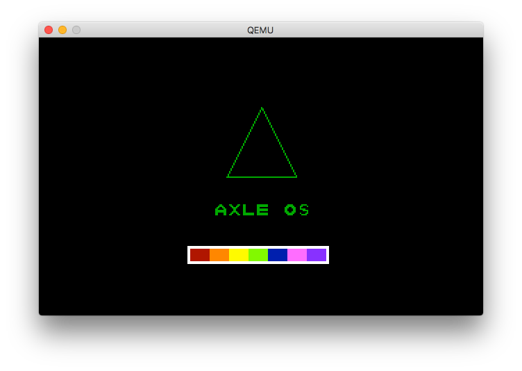
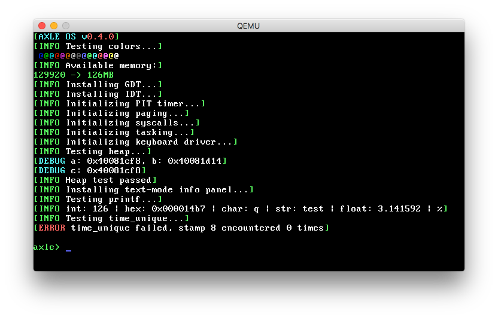
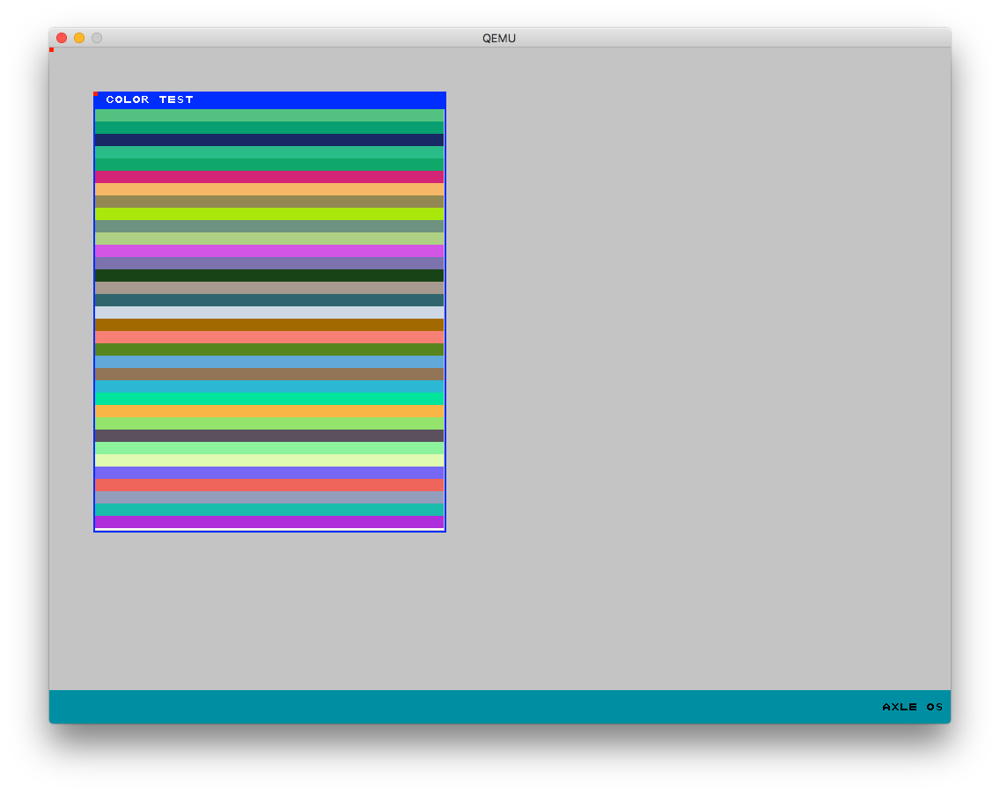

<h1 align="center">axle OS</h1>

axle is a small UNIX-like hobby operating system. Everything used within axle is implemented from the ground up, aside from the bootloader, for which we use GRUB. axle is a multiboot compliant kernel. axle runs C on 'bare metal' in freestanding mode, meaning even the C standard library is not included. A subset of the C standard library is implemented within axle's kernel, and a userspace version is planned. axle is mainly interfaced through a shell.

The initial entry point must be done in ASM, as we have to do some special tasks such as setting up the GRUB header, pushing our stack, and calling our C entry point. This means that the first code run is in `boot.s`, but the 'real' entry point is in `kernel.c`.

Features
------------
* Monolithic kernel
* PS/2 keyboard/mouse drivers
* PIT/RTC drivers
* Various graphics modes/resolutions
* Graphics library
* Window manager
* Text renderer
* Paging
* Multicolored, scrolling shell with history
* Kernel-space standard library
* Multitasking
* User mode (ring3)
* Syscalls
* Software interrupts

Graphics
-------------

While axle is mainly used through a terminal, VGA and higher-resolution VESA drivers are available, along with a small graphics library which can be used with both modes. A window manager and associated API is also provided. VGA mode supports 256 colors and VESA supports full RGB.

##VGA graphics
Circles | Rectangles | Triangles | 
:------:|:----------:|:---------:
 |  |  | 

Julia set | Mandelbrot set
:--------:|:-------------:
 | 

##Window manager

Window manager updates are tied to the PIT. When the window server starts, a callback is added to the PIT to be ran 30 times a second. When this happens, the window manager traverses its heirarchy and draws its contents from the bottom up, and written to a temporary buffer. As `memcpy`ing to video memory is a slow operation, the window manager does not transfer the contents of the buffer to video memory if no contents have changed from the last frame. Additionally, the contents of the buffer are not modified for any UI elements whose state has not changed from the previous refresh.

axle's window manager exposes an API for creating and managing UI elements such as windows, views, labels, and more. In VESA mode, full RGB is supported.

axle includes a text renderer and a default 8x8 bitmap font.

Running
----------------------
Unless your platform natively outputs 32-bit x86 binaries, you will need a cross compiler to build axle. [http://wiki.osdev.org/GCC_Cross-Compiler](This link) provides detailed instructions on how to cross-compile GCC to build suitable binaries.
axle uses QEMU as its standard emulator, though any other could be used, such as Bochs. To modify this and other build parameters, see the `Makefile`.
To run and test axle on OS X, run `./install.sh` to install the necessary requirements, then `make run` to start the emulator.

Roadmap
---------------------

- [x] Keyboard driver
- [x] Hardware interrupts
- [ ] Snake!
- [x] Software interrupts
- [x] Paging
- [x] Organize files
- [x] Syscalls
- [x] Multitasking
- [x] User mode
- [x] VESA
- [ ] Automatic resolution detection
- [x] GFX library
- [x] Window manager
- [x] Shutdown/reboot commands
- [ ] Modifiable filesystem
- [ ] Load external binaries
- [ ] Thread API
- [ ] Polygon support 
- [ ] UI toolkit

License
--------------
MIT license. axle is provided free of charge for use or learning purposes. If you create a derivative work based on axle, please provide attribution to the original project.
